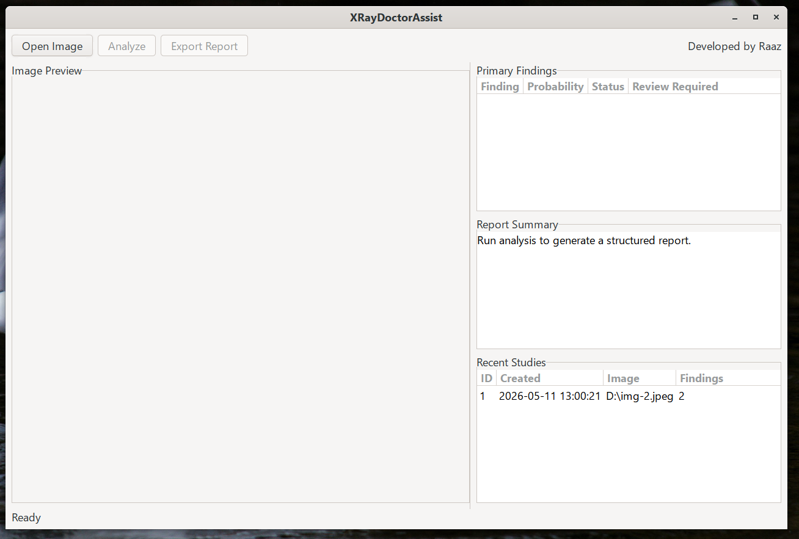
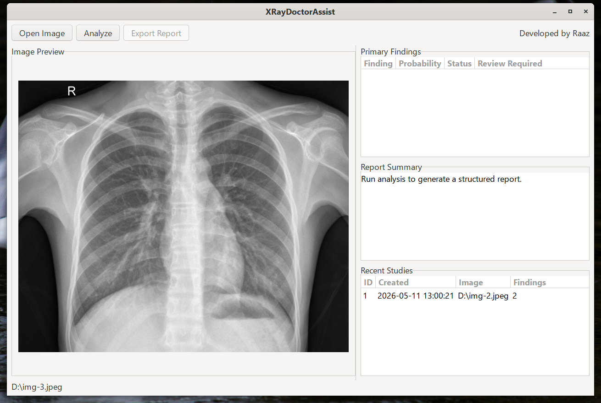
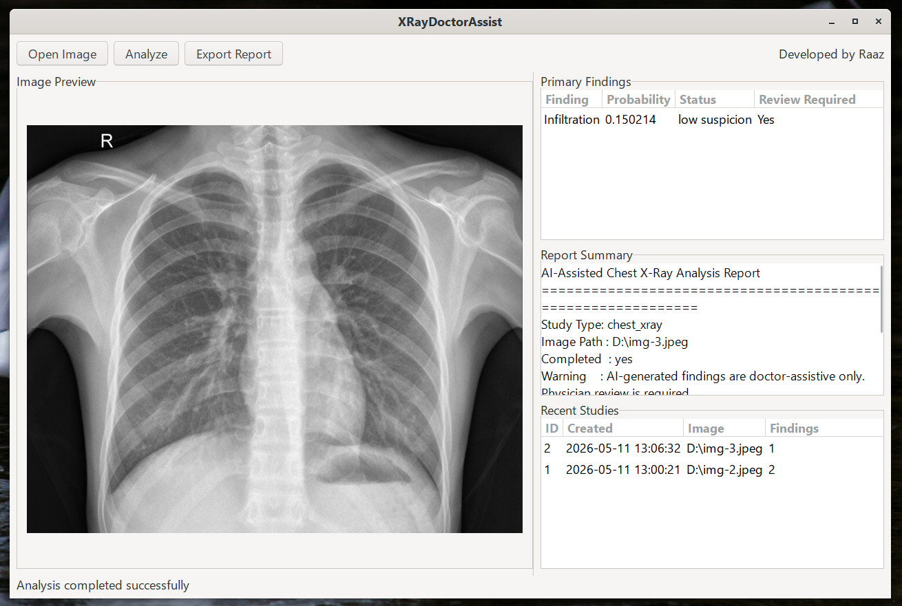
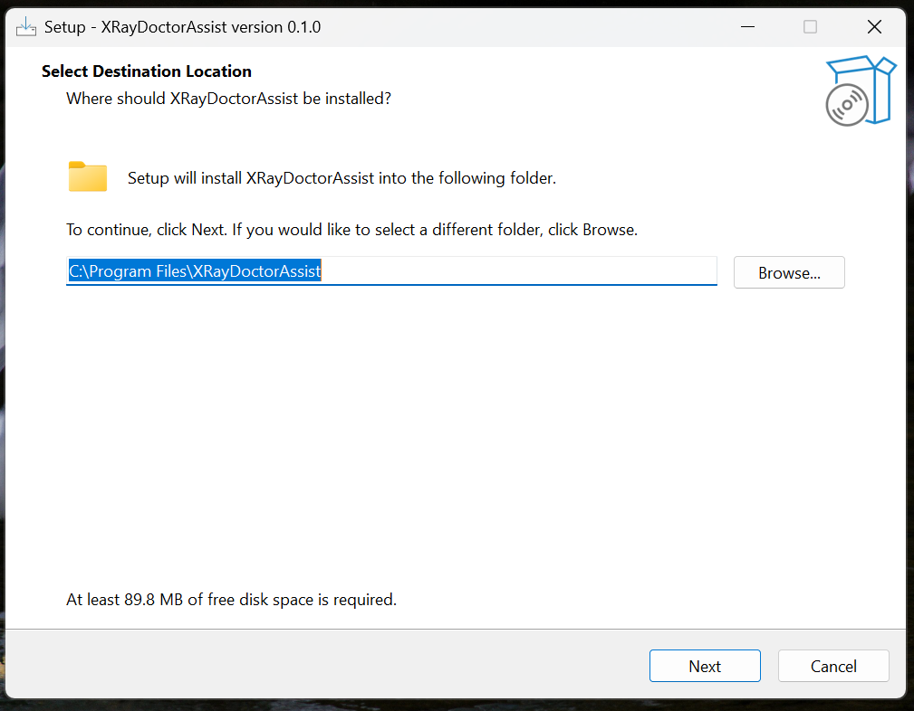
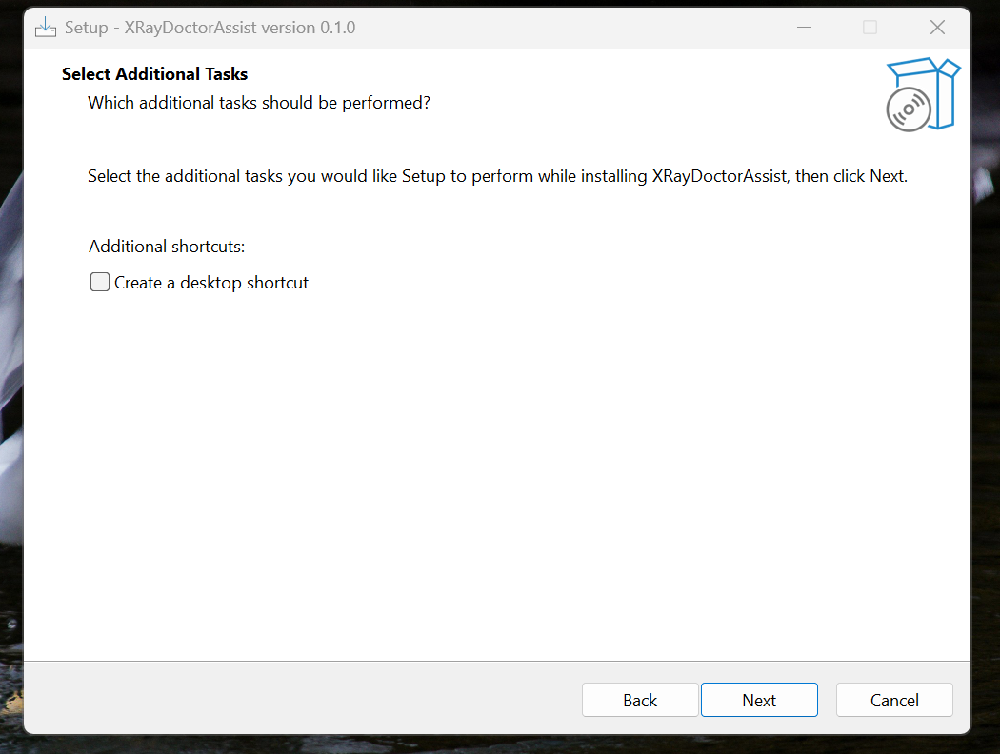
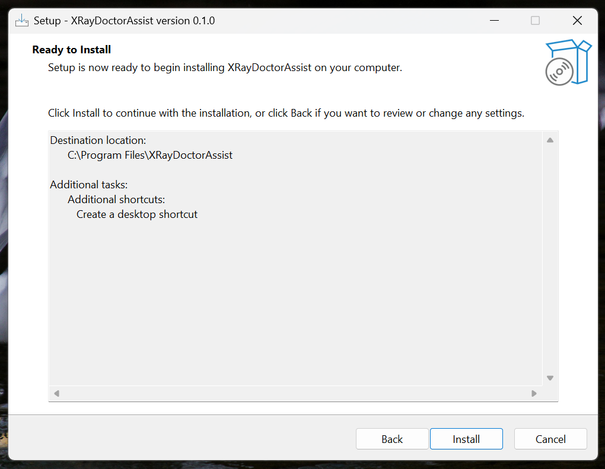
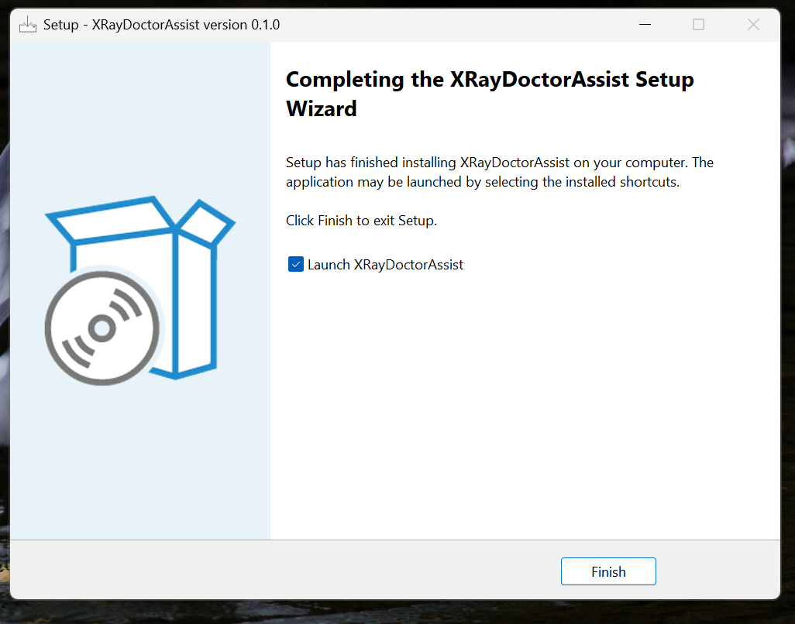

# XRayDoctorAssist

Production-grade C-based AI deployment platform for offline chest X-ray analysis, backed by a strong validation engineering pipeline.

This repository is not just a demo model wrapper. It contains:

- a native C inference pipeline,
- a GTK desktop application,
- a CLI tool,
- SQLite-backed persistence,
- deterministic preprocessing validation,
- ONNX export and equivalence validation,
- Windows packaging assets,
- and a controlled validation dataset used to freeze runtime contracts before deployment.

The platform is designed for offline, doctor-assistive use. It generates AI findings and structured reports, but physician review is always required.

## Screenshots

### Desktop Application







### Windows Installation Flow









## What This Project Is

`XRayDoctorAssist` is an offline chest X-ray AI deployment system built around a validated `TorchXRayVision DenseNet121` model exported to ONNX and executed from native C through ONNX Runtime.

The repo combines two layers:

1. A validation and model-freezing pipeline in Python.
2. A deployment/runtime layer in C for real application delivery.

That separation is the main engineering strength of the project. The Python side defines and validates the inference contract. The C side consumes that frozen contract in a production-oriented runtime with reporting, persistence, packaging, and UI.

## Core Capabilities

- Offline chest X-ray inference with ONNX Runtime
- Native C preprocessing from grayscale image to `float32 [1,1,224,224]` tensor
- Rule-based interpretation over 18 model outputs
- Structured JSON report generation
- SQLite persistence for studies, findings, and logs
- Desktop GUI built with GTK3
- CLI for direct batch-style execution
- Deterministic validation artifacts for preprocessing and inference comparison
- Windows packaging and installer output

## Model and Inference Contract

### Approved Model

- Provider: `TorchXRayVision`
- Architecture: `DenseNet121`
- Weights: `densenet121-res224-all`
- Deployment artifact: `models/chest_xray_model.onnx`
- Execution provider: `CPUExecutionProvider`

### Input Contract

- Layout: `NCHW`
- Shape: `[1, 1, 224, 224]`
- Type: `float32`
- Channels: `1`
- Modality: chest X-ray

### Preprocessing Contract

The C runtime mirrors the validated Python preprocessing path:

1. Load the source image as grayscale.
2. Resize to `224x224` using area resampling.
3. Normalize from `uint8 [0,255]` to the model intensity range:

```text
(pixel / 255.0) * 2048.0 - 1024.0
```

4. Build the final contiguous tensor `float32[1,1,224,224]`.

### Output Contract

- Output width: `18`
- Output meaning: per-pathology sigmoid probabilities in `[0,1]`
- Interpretation: handled by the C rule engine, not embedded in the ONNX graph

### Pathology Labels

1. Atelectasis
2. Consolidation
3. Infiltration
4. Pneumothorax
5. Edema
6. Emphysema
7. Fibrosis
8. Effusion
9. Pneumonia
10. Pleural_Thickening
11. Cardiomegaly
12. Nodule
13. Mass
14. Hernia
15. Lung Lesion
16. Fracture
17. Lung Opacity
18. Enlarged Cardiomediastinum

## Platform Architecture

### Validation Layer

The Python pipeline is used to acquire, validate, export, and numerically verify the model before C deployment.

Key scripts:

- `scripts/validate_environment.py`
- `scripts/download_model.py`
- `scripts/baseline_inference_validation.py`
- `scripts/run_validation_image_inference.py`
- `scripts/export_model_to_onnx.py`
- `scripts/validate_onnx_numerical_equivalence.py`

### Deployment Layer

The native runtime is implemented in C and split into focused modules:

- `src/engine/image_loader.c`: grayscale image loading
- `src/engine/preprocessor.c`: deterministic tensor creation
- `src/engine/model_runner.c`: ONNX Runtime session creation and inference
- `src/engine/model_output_validation.c`: probability vector export for validation
- `src/engine/preprocessor_validation.c`: preprocessed tensor export for validation
- `src/engine/rule_engine.c`: threshold-based finding interpretation
- `src/export/result_formatter.c`: console and JSON reporting
- `src/db/database.c`: SQLite schema and persistence
- `src/ui/main_window.c`: GTK desktop workflow
- `src/cli/main.c`: CLI entrypoint

### End-to-End Flow

```text
Chest X-ray image
  -> grayscale load
  -> deterministic resize + normalization
  -> ONNX Runtime inference in C
  -> 18 pathology probabilities
  -> rule engine thresholding
  -> JSON report
  -> SQLite persistence
  -> GUI/CLI presentation
```

## Why This Is Production-Oriented

This repo shows production intent in the places that matter:

- Model execution is offline and CPU-based.
- The ONNX model is frozen as a deployable artifact.
- Runtime paths are defined separately for Linux development and Windows installation.
- The GUI and CLI share the same core engine rather than duplicating logic.
- Every inference can emit validation artifacts, JSON reports, and database records.
- Rule-engine interpretation is explicit, reviewable, and testable.
- A dedicated test rejects invalid probability inputs such as `NaN`, `Inf`, negative values, and values above `1.0`.

## Validation Engineering

Validation is a first-class part of the repository, not an afterthought.

### 1. Environment Validation

The Python environment is checked for the required stack:

- `torch`
- `torchvision`
- `torchxrayvision`
- `onnx`
- `onnxruntime`
- `numpy`
- `Pillow`
- `cv2`
- `pandas`
- `matplotlib`
- `jsonschema`
- `pytest`

Report output:

- `reports/environment_validation_report.json`

### 2. Model Acquisition Validation

The approved TorchXRayVision model is instantiated, metadata is recorded, and a dummy forward pass is verified.

Artifacts:

- `models/model_metadata.json`
- `reports/model_download_report.json`

### 3. Baseline Inference Validation

A deterministic synthetic chest-radiograph-like tensor is used to verify:

- input contract,
- output contract,
- label count,
- repeatability,
- and basic probability integrity.

Report output:

- `reports/baseline_inference_validation_report.json`

### 4. Controlled Validation Dataset

The repo contains a controlled offline dataset for deterministic regression and runtime comparison.

Classes present in metadata:

- normal
- pneumonia
- cardiomegaly
- pleural_effusion
- pneumothorax

Primary files:

- `validation_dataset/metadata/dataset_manifest.json`
- `validation_dataset/metadata/image_registry.json`

### 5. ONNX Export Validation

The model is exported through a wrapper that preserves sigmoid probabilities while intentionally excluding TorchXRayVision `op_norm`, because that path produced runtime-invalid ONNX graph behavior.

Artifacts:

- `models/chest_xray_model.onnx`
- `reports/onnx_export_report.json`

### 6. ONNX Numerical Equivalence Validation

The repo includes a direct numerical comparison between PyTorch output and ONNX Runtime output on the controlled validation dataset.

Current checked report state:

- Status: `PASS`
- Images validated: `4`
- Absolute tolerance: `1e-4`
- Global max absolute delta: `1.7881393432617188e-07`
- Failed images: `0`

Primary report:

- `reports/onnx_numerical_validation_report.json`

### 7. C Runtime Validation Artifacts

The C engine exports internal artifacts so preprocessing and ONNX execution can be compared against the validated Python pipeline.

Artifact directories:

- `reports/preprocessing_validation/`
- `reports/onnx_c_runtime_validation/`
- `reports/final_reports/`

Examples:

- `reports/preprocessing_validation/c_tensor_pneumonia_001.bin`
- `reports/onnx_c_runtime_validation/c_probabilities_pneumonia_001.bin`
- `reports/final_reports/report_pneumonia_001.json`

## Rule Engine Policy

The rule engine converts raw probabilities into doctor-assistive textual findings using thresholds from `rules/thresholds.json`.

Default interpretation policy:

- `probability < 0.10`: not suspected
- `0.10 <= probability < 0.30`: low suspicion
- `0.30 <= probability < 0.60`: suspected
- `probability >= 0.60`: strongly suspected

Every surfaced finding is marked as requiring physician review.

## Desktop GUI

The GTK3 application provides:

- image selection and preview,
- asynchronous analysis execution,
- findings table rendering,
- generated report view,
- export/report path feedback,
- and recent analysis history loaded from SQLite.

Linux binary target:

- `build/xray-gui`

Windows packaged executable:

- `dist/windows/XRayDoctorAssist.exe`
- `package/app/XRayDoctorAssist.exe`

Installer artifact already present in the repo:

- `package/output/XRayDoctorAssist_Setup_v0.1.0.exe`

## CLI

The CLI provides the same engine-backed analysis path without the GUI.

Linux binary target:

- `build/xray-cli`

Usage:

```bash
./build/xray-cli validation_dataset/pneumonia/pneumonia_001.jpeg
```

Help:

```bash
./build/xray-cli --help
```

## Reports and Persistence

### JSON Reports

Each completed analysis writes a structured JSON report with:

- study type,
- image path,
- completion state,
- warning text,
- finding count,
- pathology findings,
- probability values,
- status labels,
- doctor review flags.

Example output location on Linux:

- `reports/final_reports/report_<image_stem>.json`

### SQLite Database

The runtime persists data into SQLite tables:

- `studies`
- `findings`
- `app_logs`

Linux database path:

- `data/app.sqlite`

Windows installed database path:

- `C:\ProgramData\XRayDoctorAssist\data\app.sqlite`

## Runtime Paths

The project already separates development and installed runtime behavior.

### Linux Development Paths

- Model: `models/chest_xray_model.onnx`
- Database: `data/app.sqlite`
- Final reports: `reports/final_reports`
- Preprocessing validation: `reports/preprocessing_validation`
- ONNX validation: `reports/onnx_c_runtime_validation`

### Windows Installed Paths

- Model: `models\chest_xray_model.onnx`
- Database: `C:\ProgramData\XRayDoctorAssist\data\app.sqlite`
- Final reports: `C:\ProgramData\XRayDoctorAssist\reports\final_reports`
- Preprocessing validation: `C:\ProgramData\XRayDoctorAssist\reports\preprocessing_validation`
- ONNX validation: `C:\ProgramData\XRayDoctorAssist\reports\onnx_c_runtime_validation`

## Build Requirements

### Linux

- `cmake >= 3.20`
- C11 compiler (`gcc` or `clang`)
- `pkg-config`
- `gtk+-3.0`
- `gdk-pixbuf-2.0`
- `sqlite3`
- vendored ONNX Runtime under `third_party/onnxruntime/onnxruntime-linux-x64-1.18.1`

### Python Validation Environment

- Python `3.11` for `setup.sh`
- dependencies from `requirements.cpu.txt`

### Windows Cross-Build

- MXE MinGW shared toolchain
- GTK3 and SQLite3 pkg-config entries for the MXE target
- vendored ONNX Runtime under `third_party/onnxruntime/onnxruntime-win-x64-1.18.1`

## Quick Start

### 1. Prepare the Python Validation Environment

```bash
./setup.sh
```

This creates `.venv`, installs the CPU validation stack, and runs environment validation.

### 2. Run the Validation Pipeline

```bash
source .venv/bin/activate
python scripts/download_model.py
python scripts/baseline_inference_validation.py
python scripts/export_model_to_onnx.py
python scripts/validate_onnx_numerical_equivalence.py
```

### 3. Build the Native C Targets on Linux

```bash
cmake -S . -B build
cmake --build build
```

Built targets:

- `build/xray-cli`
- `build/xray-gui`
- `build/test-rule-engine-invalid-probability`

### 4. Run the GUI

```bash
./build/xray-gui
```

### 5. Run the CLI

```bash
./build/xray-cli validation_dataset/normal/normal_001.jpg
```

### 6. Run the Safety Test

```bash
./build/test-rule-engine-invalid-probability
```

## Windows Build

The repo also includes a Windows-oriented makefile:

```bash
make -f Makefile.win
```

This produces:

- `dist/windows/XRayDoctorAssist.exe`

The repository also contains packaged Windows application files under `package/` and an installer script at `package/installer.iss`.

## Repository Layout

```text
.
├── config/                    # model/runtime configuration
├── data/                      # SQLite database
├── dist/windows/              # Windows build output
├── include/                   # public C headers
├── models/                    # validated ONNX model + metadata
├── package/                   # packaged Windows app and installer assets
├── reports/                   # validation outputs and final reports
├── rules/                     # rule-engine thresholds
├── screenshots/               # README screenshots
├── scripts/                   # Python validation and export pipeline
├── src/                       # native C implementation
├── tests/                     # focused runtime tests
├── third_party/onnxruntime/   # vendored ONNX Runtime
└── validation_dataset/        # controlled validation images + metadata
```

## Engineering Notes

- ONNX Runtime is linked directly from C through the C API.
- Linux builds use CMake; Windows cross-builds use `Makefile.win`.
- The GUI and CLI both call the same engine path, which reduces integration drift.
- The ONNX export deliberately keeps threshold interpretation outside the graph so deployment logic remains explicit and testable in C.
- The preprocessing path is deterministic and instrumented for binary tensor comparison.

## Safety and Scope

- This system is doctor-assistive only.
- It is not a standalone diagnostic device.
- All generated findings require physician review.
- The included dataset is a controlled engineering validation dataset, not a clinical trial dataset.
- The current runtime is CPU-only.
- Input support is currently grayscale `jpg`, `jpeg`, and `png`, with future DICOM support noted in dataset planning metadata.

## Current State of the Repository

At the time reflected by the checked artifacts in this repo:

- the ONNX deployment artifact is present,
- the Linux and Windows runtime assets are present,
- the GUI and CLI targets are defined,
- the numerical ONNX validation report is passing,
- and the repository already contains example generated final reports and packaged Windows deliverables.

In practical terms, this repository already demonstrates the full bridge from AI model validation to native desktop deployment.
